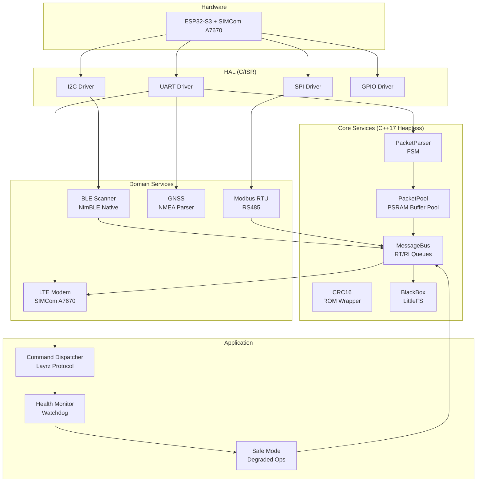
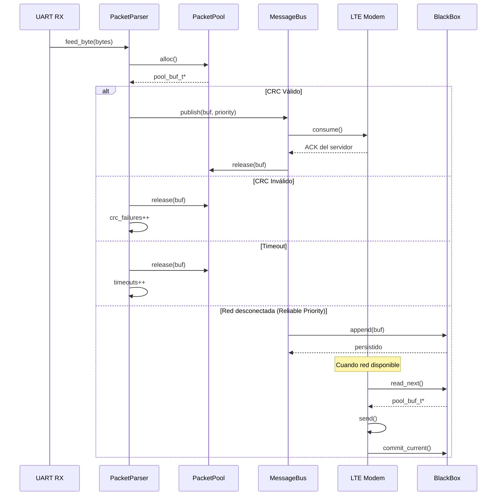
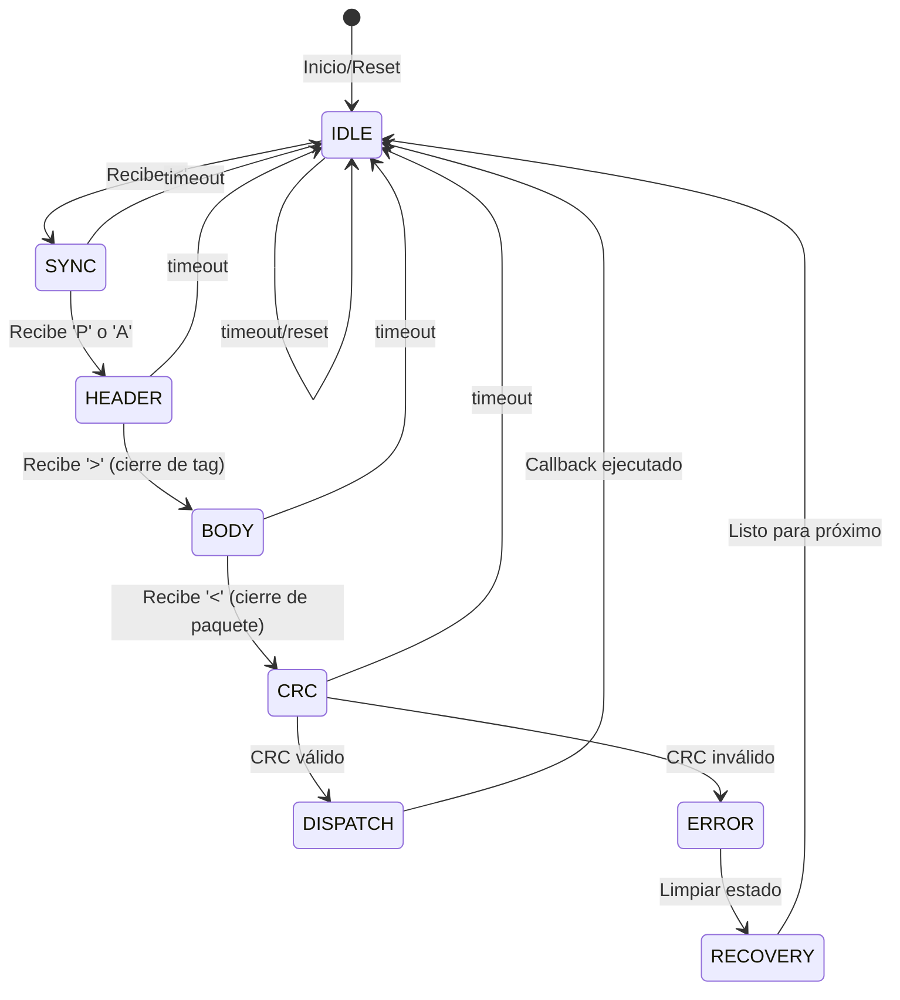
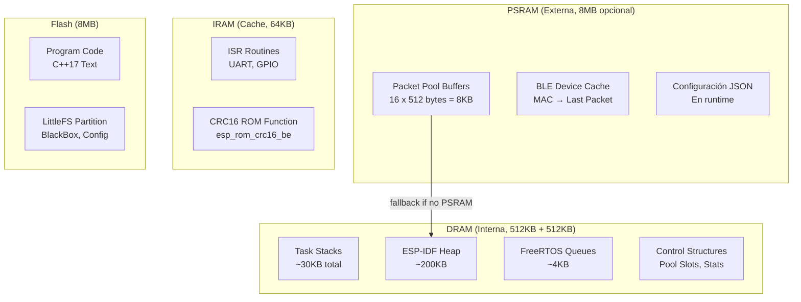
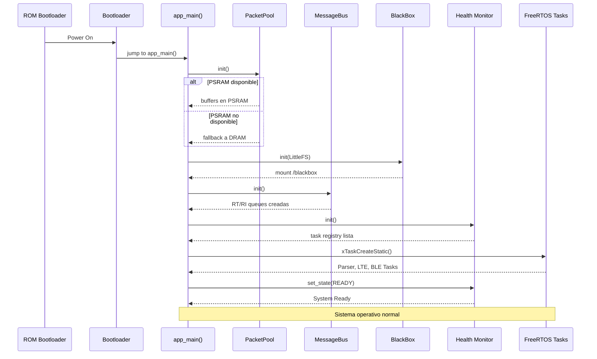
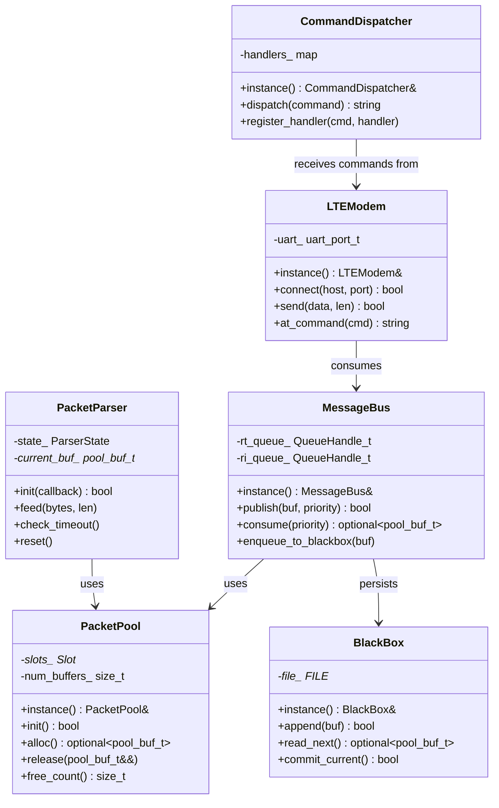

# System Architecture

## Layers
1. HAL (UART, SPI, I2C, GPIO)
2. Core (Pool, CRC16, Parser, MessageBus)
3. Services (LTE, BLE, GNSS, Modbus)
4. Application (Main, Commands)

## Components
- `components/pool/` - PSRAM buffer pool
- `components/crc16/` - CRC calculation
- `components/parser/` - FSM packet parser
- `components/message_bus/` - RT/RI queues
- `components/blackbox/` - LittleFS persistence

## Memory Model
- PSRAM: buffers (16x512)
- DRAM: stacks, control structures

## Diagrams

Architecture diagram (embedded) and saved Mermaid sources in `docs/diagrams/`.

### Architecture

### Packet lifecycle

### FreeRTOS Task Layout

```mermaid
graph LR
	subgraph "Core 1 (Critical)"
		PARSER[Parser Task<br/>Priority 5<br/>Stack 4KB]
		BUS[MessageBus Task<br/>Priority 5<br/>Stack 4KB]
		HEALTH[Health Task<br/>Priority 6<br/>Stack 2KB]
	end
    
	subgraph "Core 0 (Services)"
		LTE[LTE Task<br/>Priority 3<br/>Stack 8KB]
		BLE[BLE Task<br/>Priority 3<br/>Stack 8KB]
		MODBUS[Modbus Task<br/>Priority 2<br/>Stack 4KB]
		CMD[Command Task<br/>Priority 3<br/>Stack 4KB]
	end
    
	subgraph "Sincronización"
		RTQ[RT Queue<br/>Real-time]
		RIQ[RI Queue<br/>Retry/Blackbox]
		EG[Event Group<br/>System Events]
	end
    
	PARSER -->|publish| RTQ
	PARSER -->|publish| RIQ
	BUS -->|consume| RTQ
	BUS -->|consume| RIQ
	LTE -->|signal| EG
	BLE -->|signal| EG
	HEALTH -->|monitor| EG
```

### Parser FSM

### Memory Map

### Boot Sequence

### Class Diagram

